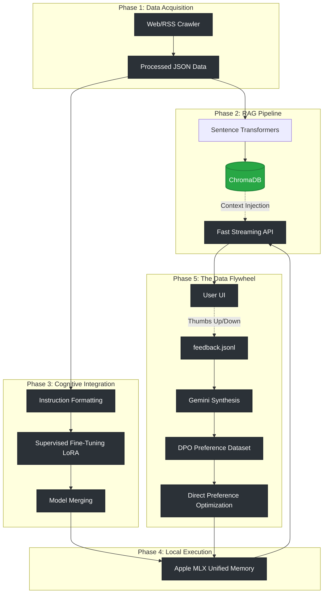

# 🧠 SelfSmart AI

<div align="center">


**A RAG-enhanced chatbot with manual fine-tuning capabilities for domain-specific knowledge integration.**

[Architecture](./ARCHITECTURE.md) · [Deployment Guide](./DEPLOYMENT.md)

</div>

---

## 📌 The Engineering Vision

SelfSmart addresses a limitation of static LLMs: **knowledge cutoff dates**. By integrating web crawling with Retrieval-Augmented Generation (RAG), the system can access up-to-date information without retraining. For domain-specific use cases, manual LoRA/DPO fine-tuning scripts allow knowledge to be baked directly into model weights.

> **Core Thesis:** Combine RAG for fresh context access with optional fine-tuning for domain specialization. RAG provides immediate knowledge updates; fine-tuning encodes domain expertise into model weights for efficiency.

---

## 🏗️ System Architecture

The system has 5 phases for knowledge integration. Phases 1-2 (data collection and RAG) are automated. Phases 3-5 (fine-tuning) are manual scripts that require developer execution.



---

## ✅ System Capabilities (The 5 Phases)

| Phase | Feature | Engineering Details | Automation Status |
|---|---|---|---|
| **1** | Web Crawling | Async data collector pulling HTML/RSS into JSON pipelines via `aiohttp` and `BeautifulSoup4`. | Manual script execution |
| **2** | RAG Search Engine | `ChromaDB` integration with `sentence-transformers` for semantic retrieval and context-grounding. | Automated in chat flow |
| **3** | SFT LoRA Fine-Tuning | PyTorch `peft` and `trl.SFTTrainer` pipelines for domain-specific knowledge integration. | Manual script execution |
| **4** | Apple MLX Inference | `mlx-lm` for native Apple Silicon Unified Memory execution with streaming SSE responses. | Automated in chat flow |
| **5** | DPO Training | RLHF pipeline using `trl.DPOTrainer` with Gemini-synthesized preference pairs from user feedback. | Manual script execution |

---

## 🚀 Quick Start

### Prerequisites
- Python 3.9 - 3.11
- Node.js 20+
- Apple Silicon Mac (M1/M2/M3) recommended for local MLX inference

### 1. Installation
```bash
git clone https://github.com/genius-0963/SelfSmart.git
cd SelfSmart

python3 -m venv .venv
source .venv/bin/activate

pip install -r requirements.txt
```

### 2. Environment Configuration
```bash
cp .env.example .env
```
Add your `GEMINI_API_KEY` (used for data synthesis and evaluation) inside `.env`.

### 3. Start the Ecosystem
```bash
# Terminal 1: Backend API
uvicorn src.api.main:app --host 0.0.0.0 --port 8000 --reload

# Terminal 2: Frontend UI
cd frontend && npm install && npm run dev
```

---

## 🔭 Potential Applications

The SelfSmart architecture could be adapted for various domain-specific use cases:

1. **Technical Documentation Assistant:**
   Crawl and ingest technical docs, API references, and code repositories. Use RAG for immediate Q&A and fine-tune for domain-specific terminology.

2. **Corporate Knowledge Base:**
   Index internal wikis, Slack conversations, and documentation. RAG provides fresh context; fine-tuning encodes company-specific jargon.

3. **Research Assistant:**
   Digest academic papers and research publications. RAG retrieves relevant papers; fine-tuning adapts to specific research domains.

---

[ROADMAP](./ROADMAP.md) · [Deployment Guide](./DEPLOYMENT.md)

---

## 🛠️ Tech Stack

### AI / ML Core
| Layer | Technology | Purpose |
|---|---|---|
| Inference Engine | **Apple MLX (`mlx-lm`)** | High-speed, native Apple Silicon LLM execution |
| Alignment (RLHF) | **TRL (`DPOTrainer`)** | Direct Preference Optimization using human feedback |
| Fine-Tuning (SFT) | **PEFT (`LoRA`)** | Parameter-efficient weight updates on Kaggle/Local GPUs |
| Vector Store | **ChromaDB** | Local persistent semantic memory |

### Backend Infrastructure
| Layer | Technology | Purpose |
|---|---|---|
| Framework | **FastAPI** | Async REST, Server-Sent Events (SSE) streaming |
| Automation | **asyncio** | Concurrent web crawling and dataset synthesis |
| Synthesis | **Gemini API** | Generates missing preference pairs for DPO datasets |

---

## 🗂️ Project Structure

```
SelfSmart/
├── src/
│   ├── api/main.py               # FastAPI application entry point
│   ├── llm_training/
│   │   ├── inference.py          # MLX-powered LocalLLMClient
│   │   ├── lora_trainer.py       # SFTTrainer Pipeline
│   │   └── dpo_trainer.py        # RLHF DPOTrainerManager
│   └── llm/                      # RAG logic and Gemini API integrations
│
├── scripts/
│   ├── build_dataset.py          # Phase 1: Web Scraper -> Instruction JSON
│   ├── ingest_data.py            # Phase 2: Instruction JSON -> ChromaDB RAG
│   ├── build_dpo_dataset.py      # Phase 5: Feedback JSONL -> DPO Triplets
│   ├── train_local.py            # Local LoRA SFT Execution
│   └── train_dpo.py              # Local DPO Execution
│
├── data/                         # Persistent SQLite and Feedback logs
├── vector_store/                 # ChromaDB storage
├── training_data/                # Raw and Processed JSON datasets
├── models/                       # LoRA Checkpoints and Merged Safetensors
│
├── kaggle_train.ipynb            # Cloud GPU SFT Notebook
└── kaggle_dpo.ipynb              # Cloud GPU DPO Notebook
```

---

## 🔬 Engineering Principles

SelfSmart is designed with a Senior AI/ML Engineering mindset:

| Principle | How It's Applied |
|---|---|
| **Hardware Symbiosis** | We ditched PyTorch inference on Mac in favor of `mlx-lm` to tap directly into Apple's Unified Memory, bypassing expensive CUDA constraints. |
| **VRAM Optimization** | Kaggle notebooks utilize `bitsandbytes` 4-bit NF4 quantization to squeeze 3.8B parameter models into 16GB T4 instances without OOM crashes. |
| **Data Integrity** | Instead of manually writing synthetic data, the DPO builder proxies through Gemini to guarantee structurally perfect `chosen`/`rejected` pairings. |
| **Architectural Agility** | The system is highly modular. The LLM engine, RAG database, and UI are fully decoupled, allowing plug-and-play swaps as the ecosystem evolves. |

---

## 🤝 Contributing & License

Contributions are welcome. Please keep PRs focused and ensure they align with the `ARCHITECTURE.md`.
This project is licensed under the **MIT License**.

---

<div align="center">

⭐ **If SelfSmart helped you envision the future of autonomous AI, give it a star!** ⭐

Built with 🧠 and ☕ by **Subh** | [Report a Bug](https://github.com/genius-0963/SelfSmart/issues)

</div>
