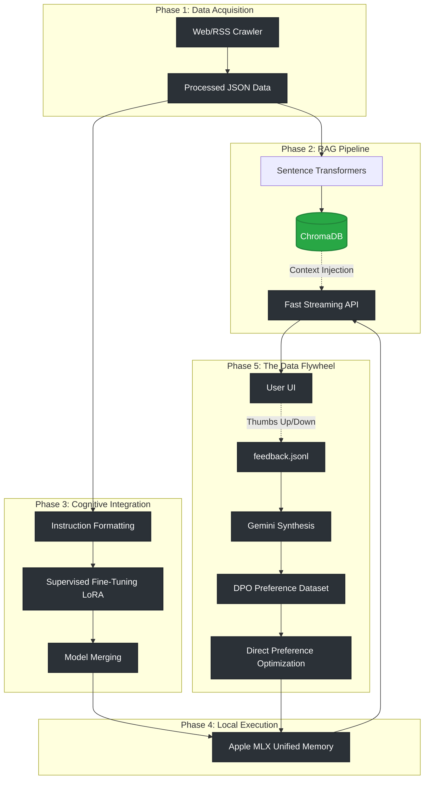
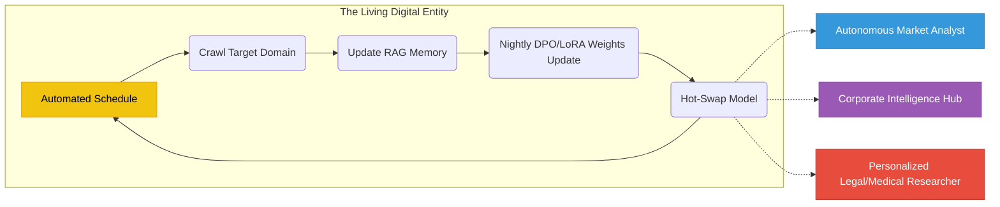

# 🧠 SelfSmart AI

<div align="center">


**A production-grade, autonomous AI platform representing a paradigm shift from static language models to dynamic, continuously learning digital entities.**

[Architecture](./ARCHITECTURE.md) · [Deployment Guide](./DEPLOYMENT.md)

</div>

---

## 📌 The Engineering Vision

SelfSmart is **not a chatbot wrapper**. It is an end-to-end AI cognitive architecture engineered to solve the fundamental limitation of static LLMs: **they stop learning the moment training ends**.

By integrating an intelligent web-crawling engine with a production-grade Retrieval-Augmented Generation (RAG) pipeline, high-speed MLX inference, and a LoRA/DPO fine-tuning workflow, SelfSmart creates a **"virtuous cycle"**. The assistant retrieves the latest information from the internet to answer current queries, and eventually absorbs that knowledge directly into its core neural weights. 

> **Core Thesis:** AI agents should no longer be limited by their initial training cutoff dates. They must be living digital entities that grow more knowledgeable and specialized with every hour they spend exploring the digital frontier.

---

## 🏗️ The "Virtuous Cycle" Architecture

The system operates on a 5-phase continuous loop, moving data from the external world directly into the model's synapses.



---

## ✅ System Capabilities (The 5 Phases)

We have successfully engineered and deployed the following subsystems:

| Phase | Feature | Engineering Details |
|---|---|---|
| **1** | Automated Web Crawling | Async data collector pulling HTML/RSS into JSON pipelines via `aiohttp` and `BeautifulSoup4`. |
| **2** | Hybrid RAG Search Engine | `ChromaDB` integration with `sentence-transformers` for millisecond semantic retrieval and context-grounding. |
| **3** | SFT LoRA Fine-Tuning | PyTorch `peft` and `trl.SFTTrainer` pipelines. Cloud-ready Kaggle notebooks to bake scraped knowledge into LLM weights. |
| **4** | Apple MLX Inference | Complete swap from PyTorch to `mlx-lm` for native Apple Silicon Unified Memory execution. Fast, 4-bit streaming SSE responses. |
| **5** | DPO Data Flywheel | RLHF pipeline using `trl.DPOTrainer`. Automatically synthesizes `(prompt, chosen, rejected)` datasets from UI feedback to continuously self-correct the model. |

---

## 🚀 Quick Start

### Prerequisites
- Python 3.9 - 3.11
- Node.js 20+
- Apple Silicon Mac (M1/M2/M3) recommended for local MLX inference

### 1. Installation
```bash
git clone https://github.com/genius-0963/SelfSmart.git
cd SelfSmart

python3 -m venv .venv
source .venv/bin/activate

pip install -r requirements.txt
```

### 2. Environment Configuration
```bash
cp .env.example .env
```
Add your `GEMINI_API_KEY` (used for data synthesis and evaluation) inside `.env`.

### 3. Start the Ecosystem
```bash
# Terminal 1: Backend API
python -m src.web_server

# Terminal 2: Frontend UI
cd frontend && npm install && npm run dev
```

---

## 🔭 Future Scope: The Autonomous Paradigm

The current SelfSmart architecture provides the foundational blueprint for a new class of **Autonomous Enterprise Agents**. 

By attaching an automated Chron Job to our 5-Phase pipeline, SelfSmart evolves from a reactive chatbot into a proactive, living system. 



### Real-World Applications

1. **The Autonomous Market Analyst:** 
   Deployed to track global economic shifts, the agent automatically scrapes financial RSS feeds, SEC filings, and Twitter sentiment every hour. It stores exact quotes in RAG for immediate Q&A, and fine-tunes itself on macro-trends overnight.
   
2. **Corporate Intelligence Hub:**
   Connected to internal Slack, Jira, and Confluence. It continuously learns the evolving jargon, product specs, and culture of the company, effectively becoming the ultimate senior engineering onboarding assistant.
   
3. **Personalized Medical/Legal Researcher:**
   Programmed to digest the latest PubMed journals or Supreme Court rulings. It never suffers from a "2023 training cutoff date" because it rewrites its own neural synapses every week based on newly published literature.

---

## 🛠️ Tech Stack

### AI / ML Core
| Layer | Technology | Purpose |
|---|---|---|
| Inference Engine | **Apple MLX (`mlx-lm`)** | High-speed, native Apple Silicon LLM execution |
| Alignment (RLHF) | **TRL (`DPOTrainer`)** | Direct Preference Optimization using human feedback |
| Fine-Tuning (SFT) | **PEFT (`LoRA`)** | Parameter-efficient weight updates on Kaggle/Local GPUs |
| Vector Store | **ChromaDB** | Local persistent semantic memory |

### Backend Infrastructure
| Layer | Technology | Purpose |
|---|---|---|
| Framework | **FastAPI** | Async REST, Server-Sent Events (SSE) streaming |
| Automation | **asyncio** | Concurrent web crawling and dataset synthesis |
| Synthesis | **Gemini API** | Generates missing preference pairs for DPO datasets |

---

## 🗂️ Project Structure

```
SelfSmart/
├── src/                          
│   ├── web_server.py             # FastAPI streaming endpoints & Feedback API
│   ├── llm_training/             
│   │   ├── inference.py          # MLX-powered LocalLLMClient
│   │   ├── lora_trainer.py       # SFTTrainer Pipeline
│   │   └── dpo_trainer.py        # RLHF DPOTrainerManager
│   └── llm/                      # RAG logic and Gemini API integrations
│
├── scripts/                      
│   ├── build_dataset.py          # Phase 1: Web Scraper -> Instruction JSON
│   ├── ingest_data.py            # Phase 2: Instruction JSON -> ChromaDB RAG
│   ├── build_dpo_dataset.py      # Phase 5: Feedback JSONL -> DPO Triplets
│   ├── train_local.py            # Local LoRA SFT Execution
│   └── train_dpo.py              # Local DPO Execution
│
├── data/                         # Persistent SQLite and Feedback logs
├── vector_store/                 # ChromaDB storage
├── training_data/                # Raw and Processed JSON datasets
├── models/                       # LoRA Checkpoints and Merged Safetensors
│
├── kaggle_train.ipynb            # Cloud GPU SFT Notebook
└── kaggle_dpo.ipynb              # Cloud GPU DPO Notebook
```

---

## 🔬 Engineering Principles

SelfSmart is designed with a Senior AI/ML Engineering mindset:

| Principle | How It's Applied |
|---|---|
| **Hardware Symbiosis** | We ditched PyTorch inference on Mac in favor of `mlx-lm` to tap directly into Apple's Unified Memory, bypassing expensive CUDA constraints. |
| **VRAM Optimization** | Kaggle notebooks utilize `bitsandbytes` 4-bit NF4 quantization to squeeze 3.8B parameter models into 16GB T4 instances without OOM crashes. |
| **Data Integrity** | Instead of manually writing synthetic data, the DPO builder proxies through Gemini to guarantee structurally perfect `chosen`/`rejected` pairings. |
| **Architectural Agility** | The system is highly modular. The LLM engine, RAG database, and UI are fully decoupled, allowing plug-and-play swaps as the ecosystem evolves. |

---

## 🤝 Contributing & License

Contributions are welcome. Please keep PRs focused and ensure they align with the `ARCHITECTURE.md`.
This project is licensed under the **MIT License**.

---

<div align="center">

⭐ **If SelfSmart helped you envision the future of autonomous AI, give it a star!** ⭐

Built with 🧠 and ☕ by **Subh** | [Report a Bug](https://github.com/genius-0963/SelfSmart/issues)

</div>
